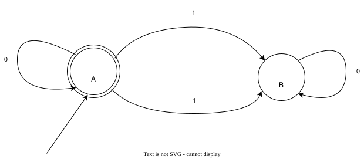
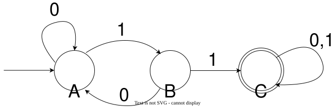

## 写在前面

这是一个小尝试，一直以来都对计算理论很感兴趣，暑假在 b 站上看了 mit Sipser 的计算理论的课程，感觉相当的美妙。然而学校并没有这门课，网上的相关的文字博客也很少。似乎 buaa 原先是开过这门课的，但是后来变成了一个 1 学分的计算引论……

于是就产生了这个博客，当作是笔记一类的东西，用教程的方式写出来也是因为大家都在这样做

贴上 b 站搬运视频链接：[MIT18.404](https://www.bilibili.com/video/BV1qL411s7mr)

那么言归正传，这部分主要探讨在“什么是计算”这个问题上一个模型：有限自动机，以及它识别的语言类型：正则语言。虽然有限自动机比较弱，离真正的计算机还有一定距离，但是并不妨碍这个模型本身很有用（比如计组的 fsm 和一堆设计 fsm 匹配正则表达式的工业题便可以追溯至此

## 有限自动机

先让我们考虑这样一种简单的机器：它读入一个字符串，然后吐出一个 0 或者 1 。这类似于一个字符串“判定器”。

> 有人要说：这似乎看起来没什么用
> 
> 看似它只能读入字符串，但实际上字符串是一个表达力很强的东西，很多数据结构可以用某种编码表示成一个字符串，只是很多编码对于有限自动机来说太强，没办法给拆出来。
>
> 如果你学过算法竞赛的话，那么你一定听过大名鼎鼎的 KMP 模式匹配算法。KMP 处理的问题就是一个读入字符串吐出 0/1 的问题（表示有没有出现过）。实际上 KMP 通过构建跳转数组本身就是一个进行匹配就是构建了一个有限自动机。很神奇吧……

我们可以用下面这样的图来描述一个有限自动机。它读入一个 01 串，如果其中有偶数个 1 就输出 1，否则输出 0 。

这个图中的有限自动机由若干圆圈节点和箭头组成。每一个圆圈节点表示一个**状态**，而箭头则是一个转移边。

那么它具体是怎么来计算的呢？你可以把这个图想象成一个迷宫。最开始有一个小人站在起点上，然后**一个字符一个字符地读取输入的字符串，每读入一个字符便沿着标有对应字符的边移动到所指的节点**。当字符串读完了，小人就停下了，最后根据停在哪个节点来判断输出 1 还是 0 。

我们用一个没有起点的箭头标记起点（这个图中就是 A）。画双圆圈的状态节点（这个图中也是 A）表示这里是出口。小人最后停在这里就可以出去，输出 1；否则输出 0。

如果输入字符串是：`00101` ，那么小人的轨迹就是：`A -> A -> A -> B -> B -> A` ，最终停在了 A，所以输出 1。

那么如果输入 `10101` 呢？小人的轨迹是：`A -> B -> B -> A -> A -> B` ，最终停在 B 所以输出 0。

相信你已经发现规律了：这个机器读入 0 时，小人只会原地踏步。真正让小人移动的是读入 1 的时候。读入奇数个 1 那么小人会停在 B，读入偶数个就会停在 A。

再来看一个例子：

这个有限自动机只在输入的 01 串中含有子串 `11` 的时候输出 1 。转移边上的 `0,1` 表示读入 0 和 1 都走这里。

---

接下来，我们对于有限自动机进行一个形式化的定义。

### 一些术语和符号

**定义** **字母表**（Alphabet）是任意一个非空的有限集。

例如 $\Sigma = \{0,1\}, \Gamma = \{a,b,c,d,e\}$ 都是字母表。

**定义** 字母表 $\Sigma$ 上的**字符串**（string over $\Sigma$）为该字母表中符号的有穷序列。

例如 $01101, 100$ 都是 $\Sigma = \{0,1\}$ 上的字符串。

用 $|w|$ 表示字符串 $w$ 的字符数（也叫长度）。长度为 $0$ 的字符串也写作 $\varepsilon$。

### 确定性有限自动机

**定义** 一个**确定性有限自动机** （Deterministic Finite Automaton, DFA）是一个五元组 $(Q, \Sigma, q_0, \delta, F)$，其中

+ $Q$ 是**有限**状态集合
+ $\Sigma$ 是输入字符串的字母表
+ $q_0 \in Q$ 是初始状态
+ $\delta: Q \times \Sigma \to Q$ 是转移函数
+ $F \subseteq Q$ 是接受状态集合

看起来似乎很抽象，但实际上也可以用刚才小人走地图的方式想象。地图的节点集合是 $Q$，小人最开始站在 $q_0$，然后按顺序读入字符串的字符（都在字母表 $\Sigma$ 里）。

$\delta$ 描述了小人的运动规则。小人当前在节点 $q\in Q$，读入了字符 $c\in \Sigma$，那么小人下一步就会走到 $\delta(q,c)$。

$F$ 则代表了“哪些节点可以出去”。读完了所有字符小人走到了 $q$ 。如果 $q \in F$，那么就输出 1，或者说 DFA **接受**了这个字符串；$q \notin F$ 则输出 0，也说 DFA **拒绝**了这个字符串。

对于这个 DFA，我们可以给出下面的形式化定义：

$$
\begin{aligned}
    &Q = \{A, B ,C\}\\
    &\Sigma = \{0,1\}\\
    &q_0 = A\\
    &F = \{C\}
\end{aligned}
$$

转移函数 $\delta$ 用下面这个表给出：

|当前状态 | $0$ | $1$ |
| :---:         | :-: | :-: |
| $A$           | $A$ | $B$ |      
| $B$           | $A$ | $C$ |
| $C$           | $C$ | $C$ |

再回来看这个名字：“确定性有限自动机”。什么是“确定性”？这个词语可以理解成小人的移动方式是固定的。转移函数 $\delta: Q \times \Sigma \to Q$ 表明了在任何一个状态节点，读入任意一个字符，都有且仅有一条路可以走。

因此，我们可以如下形式化定义 DFA 的计算过程：

**定义** $A = (Q, \Sigma, q_0, \delta, F)$ 是一个 DFA，$s = w_1w_2\dots w_n$ 是 $\Sigma$ 上的字符串。
如果存在状态序列 $r_0, r_1, \dots, r_n \in Q$，满足：

+ $\forall i \in \{1,2,\dots, n\}, \quad r_i = \delta(r_{i-1}, w_i)$
+ $r_0 = q_0$
+ $r_n \in F$

那么便说 $A$ **接受**（accept）$s$，否则说 $A$ **拒绝**（reject）$s$。

这个定义很好懂，就是在说：从起始状态出发，照着字符串一个一个走，最后能走到一个接受状态。

ok，相信到这里你可能已经对 DFA 有一个大致的了解了。那么给定一个 DFA，如何描述它的功能？对于这个有限自动机这个计算模型，它的计算能力是怎样的，如何去描述？这部分详见下一节：