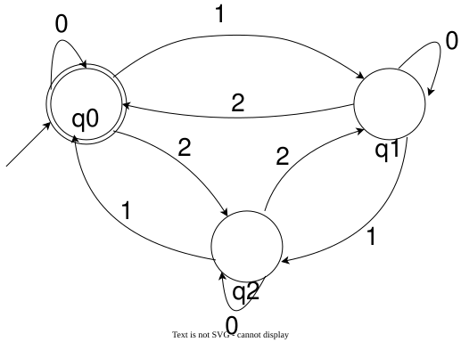

## 语言是什么

这里的语言不是日常生活中的语言（但是实际上这个名称也来自于语言学，包括后面的“文法”/“语法”），而是字符串的集合。换句话说，一个字符集 $\Sigma$ 上的语言，是 $\Sigma$ 上所有字符串的集合的一个子集。

那么对于一个 DFA 来说，它本身就将字符串分为了“接受”和“拒绝”两类。它接受的所有字符串也就构成了一个语言。

**定义** $A = (Q, \Sigma, q_0, \delta, F)$ 是一个 DFA，那么 $A$  识别的**语言** $L(A)$ 是 $A$ 接受的所有字符串的集合。即
$$
    L(A) = \{s \text{ 是 } \Sigma \text{ 上的字符串 } | A \text{ 接受 } s\}
$$

给定一个 DFA $A$，$L(A)$ 是 $A$ 识别的语言，唯一确定了它的判定功能，也就是对于给定的有限字符串 $s$ ，判断命题 $s \in L(A)$ 是否成立。

看似这个元素的所属问题很无趣，但是实际上 $L(A)$ 作为语言，实际上代表了一个谓词。

换句话说，如果我们记 $\Sigma^*$ 是字母表 $\Sigma$ 上的所有字符串构成的集合。语言 $L \subseteq \Sigma^*$ 实际上可以看成是 
$$
L = \{s \in \Sigma^* | P(s)\}
$$ 
其中 $P: \Sigma^* \to \{\text{T}, \text{F}\}$ 是一个谓词。

这意味着某种判定的问题，如果我们能把这个谓词表述成一个字符集上某个 DFA 可以识别的语言，那么这个东西就可以用 DFA 算出来了。

比如下面的 DFA：

这个 DFA 可以判定一个谓词 $P: \{0,1,2\}^* \to \{\text{T}, \text{F}\}$，表示“将这个字符串的每一个字符视作一个数，所有数的和是三的倍数”。

那么这就自然地引出了能力与边界的问题：

**DFA 到底有多强？**

**任何一个语言，都存在一个 DFA 识别它吗？**

接下来我们将逐步探讨这些问题。

### 语言的运算

为了讨论有关语言的问题，我们引入下面的运算：

**定义** 设 $A,B$ 是两个语言，如下定义三种运算：

+ 并：$A \cup B = \{x|x\in A \lor x \in B\}$
+ 连接：$A\circ B = \{xy| x \in A \land y \in B\}$
  
  这里的 $xy$ 表示把两个字符串按顺序连在一起，例如 $x=$ `"11a"`， $y=$ `"51b"` ，那么 $xy=$ `"11a51b"`。
  
  也可以省略 $\circ$，写成 $AB$。
+ 星号：$A^* = \{a_1a_2\dots a_n|n\ge 0 \land \forall i, a_i \in A\}$
  
  这里的 $a_1a_2\dots a_n$ 同样表示字符串的连接。

相信你学过离散数学之后，一定对这种新运算很熟悉，本质上就是将 一个/两个 元素映射得到一个新元素。

举个例子：

两个语言 $A = \{0,01\}, B = \{0,1,a\}$

$A \cup B = \{0,1,01,a\}$

$AB = \{00,01,0a,010,011,01a\}$

$B^* = \{\varepsilon, 0, 1, a, 00, 01, 0a, 10, 11, 1a, a0, a1, aa, \dots\}$

$A^* = \{\varepsilon, 0, 01, 00, 001, 010, 0101, \dots\}$

注意星号操作是一个一元运算，由于定义中的 $n$ 可以等于 $0$，所以 $A^*$ 和 $B^*$ 总是包含空字符串 $\varepsilon$。

### 正则语言

为了研究 DFA 的能力边界，我们将语言中“能够被 DFA 识别”的语言划成一个集合（但当前我们也仅仅是定义了出来，并没有很多了解）

**定义** 如果一个语言能够被一个 DFA 识别，那么称这个语言是 **正则的**（regular）。

那么， DFA  的能力即可以通过正则语言的范围来体现。

正则语言和以上三种运算有一个巧妙的联系：**正则语言在上面定义的三种运算（并、连接和星号）下是封闭的**。

换句话说：

如果 $A,B$ 是两个定义在同一字母表上的 DFA：
1. 一定存在一个 DFA $C$，使得 $L(C) = L(A) \cup L(B)$。
2. 一定存在一个 DFA $D$，使得 $L(D) = L(A)\circ L(B)$。
3. 一定存在一个 DFA $E$，使得 $L(E) = L(A)^*$。

> 实际上，对于两个不同字母表上的 DFA，我们可以通过字母表取并集变成这种情况。

这三种特殊的运算也称作**正则运算**。

如何去证明呢？我们通过给出一种构造方法，获得 $A,B$ 后，构造出 DFA $C,D,E$。

对于 $A = (Q_1, \Sigma, q_1, \delta_1, F_1), B = (Q_2, \Sigma, q_2, \delta_2, F_2)$，我们按照下面的方式给出 $C$ 的五元组：

$$
\begin{aligned}
Q &= Q_1 \times Q_2\\
\Sigma &= \Sigma\\
q_0 &= (q_1, q_2)\\
F &= \{(r_1, r_2) \in Q| r_1 \in F_1 \lor r_2 \in F_2\}
\end{aligned}
$$

转移函数 $\delta$ 满足：
$$
\forall r = (r_1, r_2) \in Q, c \in \Sigma, \quad \delta(r, c) = (\delta_1(r_1,c), \delta_2(r_2,c))
$$

这个构造实际上是在同时模拟两个 DFA，把读到的字符串同时喂给 $A,B$ 两个 DFA。读完字符串后，$A,B$ 如果有一个接受，那么自己也接受。否则就拒绝。

实现的核心在于 $Q = Q_1 \times Q_2$ ，这样的构造实际上使得 $Q$ 中的一个状态 $r = (r_1,r_2)$ 记录了 $A,B$ 各自目前的状态。转移函数接收到字符后分别按照 $A,B$ 的转移规则转移 $r_1$ 和 $r_2$。

---

现在我们成功证明了正则语言在 $\cup$ 上的封闭性。那么对于运算 $^*$ 和 $\circ$，是否也可以像这样构造呢？

例如对于 $L(D) = L(A) \circ L(B)$，或许你可能想到这样的构造：

既然 $L(D)$ 中的字符串是由一个 $L(A)$ 中的字符串和一个 $L(B)$ 中的字符串拼接起来的，
那么把在 $A$ 的每一个接受状态，都当成是 $B$ 的一个起始状态，在后面“接”一个 DFA $B$。
也就是说这个构造主体框架是一个 $A$，在每个 $A$ 的接受状态后面都长一个 $B$ 出来。
这样，在前面属于 $L(A)$ 的部分被 $A$ 接受，走到 $A$ 的接受状态，
接下来属于 $L(B)$ 的部分读入便会进入 $B$  中。如果走到了接上来的 $B$ 的接受状态，那么接受。

这个构造乍一看非常有道理，但是仅仅只能在 $L(A),L(B)$ 的字母表交集为空的时候才管用（但是不符合定义）。如果它们两个的字母表中有共有字符 $c$，那么从定义上就会说不通。如果 $q \in F_A$，那么 $\delta(q,c)$ 到底指向 $\delta_A(q,c)$ 还是 $\delta_B(q,c)$ ？

对于 $L(A) = \{11, 1100\}, L(B) = \{\varepsilon,01\}$ 的情况，上述构造的“DFA” 依次读入 `1`、`1`，在接下来读到 `0` 的时候，到底该进入 $B$，去找 $1101$，还是留在 $A$ ，去等 $1100$？

所以这样的构造是错误的。然而，如果我们允许机器在某一步有**多个可能的后继状态**，也就是当到达 $A$ 的接受状态时，机器既可以留在 $A$，也可以进入 $B$ 中，那么这种构造反而相当有道理。然而，DFA 的确定性使得它无法显式地实现“猜测一个切分点”这种功能。不过这并不意味着 DFA 的计算能力不足。实际上，$D,E$ 这两个 DFA 可以通过较为复杂的方式构造出来，但是现在探讨它们无异于通过阅读汇编语言来窥探 C 语言源代码。

所以，对于这两个运算的封闭性，我们选择引入一个强大的机制：非确定性。
关于强大的非确定性机制，详见下一节：