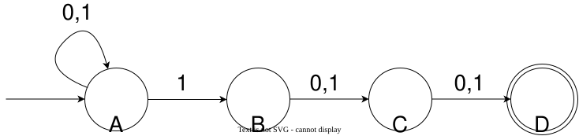
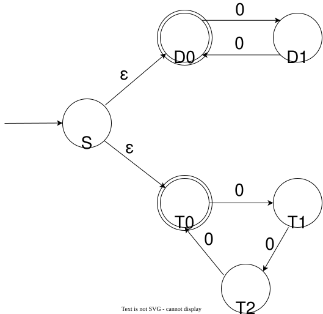
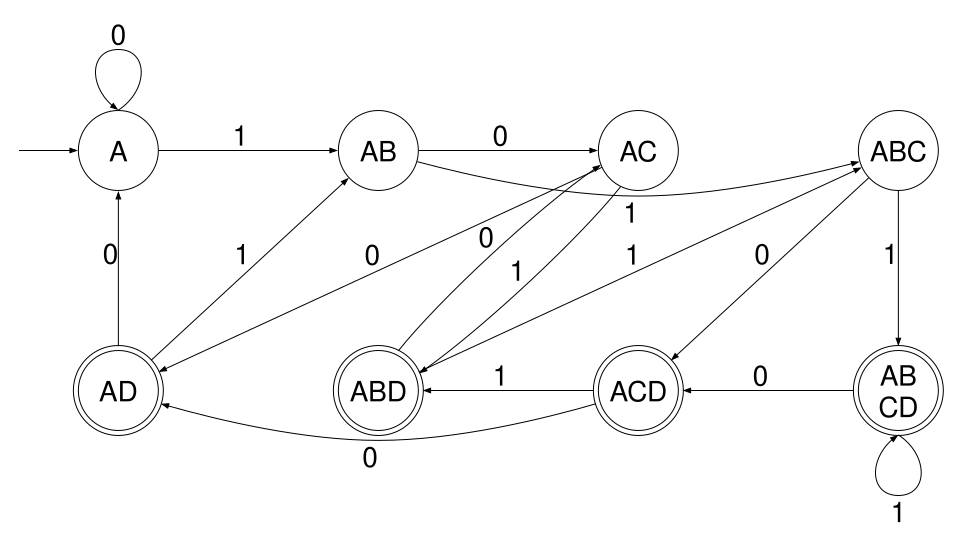

## 非确定性计算

对于我们之前提到的 DFA，它的确定性在于：对于机器的某一个给定的状态和某一个给定的输入，机器的下一个状态是唯一确定的。在形式上这一点由 $\delta: Q \times \Sigma \to Q$ 保证。

非确定性有限自动机（Nondeterministic Finite Automaton, NFA）在 DFA 的基础上进行了拓展（因此每一个 DFA 都是一个 NFA）：

+ 从一个状态节点出发的转移边中，可能有多条边上有相同的字母表符号
+ 位于某些状态节点时，读入某些字母表符号，可能不存在对应的状态转移边
+ 有些转移边是“免费的”，这意味着机器可以不读入字符而走过转移边

这意味着 NFA 在某个给定状态下，读入一个给定的输入，**下一个状态并不是唯一确定的，而是有多种可能的选择，或者甚至没有选择**。换句话说，原来在 DFA 上行走的小人，原先只是机械地进行着：读一个字符、走过对应字符的转移边、读一个字符、走过对应字符的转移边。最后在读完整个字符串之后走到一个终点，根据终点是否属于 $F$ 决定接受 / 拒绝。

但是现在，在 NFA 上的小人更像一个“走迷宫游戏玩家”：对于一个确定的字符串输入，在某个时刻，读入了字符 'a'，当前的状态节点可能有两个、三个，甚至多个标着 'a' 的转移箭头，那么这个时候，**小人可以在诸多标着 'a' 的转移箭头中选一条走**；也有可能在当前状态节点，没有标着 'a' 的转移箭头，那么这个小人会**当场死亡**；除此之外，如果当前状态节点有标着 '$\varepsilon$ '的转移箭头，那么小人可以选择**维持字符串扫描进度不变，不读入任何字符走过这条边，也可以选择读入一个字符，在标有这个字符的边里选一条走**。

这么一来，在绝大多数情况下，一个确定的 NFA，一个确定的输入字符串，会产生多条可能的行动路径。那么最后的输出到底如何决定呢？这里就更像走迷宫游戏了：**如果存在一条路径，最终小人能够走出迷宫，那么 NFA 接受，输出 1；如果小人无论如何都无法走出迷宫，那么输出 0**。

来看下面这个 NFA：

这个 NFA 识别的语言是：在字母表 $\Sigma = \{0,1\}$ 上，倒数第三个字符是 1 的字符串，也就是：
$$
    L = \{s \in \Sigma^*| s=w_1\dots w_n\land n \ge 3\land w_{n-2} = 1\}
$$

这个 NFA 与 DFA 不同的地方在于：D 没有出发的转移边，而且从 A 出发有两个标着 '1' 的转移箭头（还记得吗？箭头上标 `0,1` 的含义是 0, 1 对应的这两个转移边是重合的，起终点相同）。这两个位置也是 NFA 用于处理猜测“当前位置是否是倒数第三个字符”的部件。

在当前状态位于 A 时，若读入字符 1，那么接下来就有两条路可走。

+ 如果走了从 A 指向自己的那条边，表示 NFA 认为当前不是倒数第三个字符，继续在自环处消耗前面的 01 串。
+ 如果走了从 A 指向 B 的那条边，表示 NFA 认为当前的字符就是倒数第三个字符。

对于这个 NFA，在读入一个 $L$ 中的字符串后，只有一个分支会“通关”：也就是在倒数第三个位置的 '1' 之前都老老实实呆在 A 的自环里，在倒数第三个位置读入 1 走到 B，然后消耗剩下两个字符走到 D 成功过关。

过早走向 B 的分支，会因为走到 D 还有字符而无路可走而死掉；而过晚才走向 B 甚至始终没有走向 B 的分支，最后读完字符串就会因为没有走到双圈的终点而失败。

而对于不在 $L$ 中的字符串，哪种唯一能够通关的分支行不通了，那么无论怎么走，要么在 D 无路可走死掉，要么最终没走到 D，都会失败。因此 NFA 会正确拒绝这些不在 $L$ 中的串。

这个 NFA 识别的语言是：仅仅由 0 构成，0 的个数是 $2$ 的整数倍或者是 $3$ 的整数倍。也就是：
$$
    L = \{0^n | \exists k \in \mathbb N, n = 2k \lor n = 3k\}
$$
其中 $0^n$ 表示将字符 $0$ 重复 $n$ 次。

> 我们约定 $\mathbb N$ 是含 $0$ 的。

这个 NFA 在状态位于 S 时，有两个带着 $\varepsilon$ 的选项。这时候，它可以不读任何一个 '0' 而“免费地”走一个 $\varepsilon$ 边（当然，它也本可以选择在这回忽视这两个 $\varepsilon$ 边，选择读入一个 0, 走一个标有 0 的边走。但是没有 S 出发的 0 边，因此这条支路只能死掉）。如果走入了 D0，那么意味着它进入了 $n=2k$ 的情况；否则走入 T0，意味着进入了 $n=3k$ 的情况。

## 非确定性有限自动机

接下来，我们对 NFA 做一个形式上的定义。

**定义** 一个**非确定性有限自动机**（Nondeterministic Finite Automaton, NFA）是一个五元组 $(Q, \Sigma, q_0, \delta, F)$，其中：

+ $Q$ 是有限状态集合
+ $\Sigma$ 是输入字符串字母表
+ $q_0 \in Q$ 是起始状态
+ $F \subseteq Q$ 是接受状态集合
+ $\delta: Q \times \Sigma_{\varepsilon} \to \mathcal P(Q)$ 是状态转移函数（$\Sigma_{\varepsilon}$ 表示 $\Sigma \cup \{\varepsilon\}$） 

这里面唯一与 DFA 不同的地方在于 $\delta$。原先 DFA 的 $\delta(q, c) = r$ 是确定性的转移。

而现在 $\delta(q, c_0) = \{q_1, q_2, q_3\}$ 意味着从 $q$ 出发有三条标着 $c_0$ 的转移边，分别指向 $q_1,q_2,q_3$。$\delta(q, c_1) = \emptyset$ 意味着从 $q$ 出发没有标着 $c_1$ 的边。

$\Sigma_{\varepsilon}$ 意味着可以有 $\delta(q, \varepsilon) = \{r_1, r_2, r_3\}$ 这样免费的转移。

这个 NFA 的 转移函数 $\delta$ 可以用下面的表格描述：

| 状态 | $0$    | $1$       | $\varepsilon$ |
| :--: | :--:   | :--:      |           :--:|
| $A$  | $\{A\}$ |$\{A, B\}$ | $\emptyset$   |
| $B$  | $\{C\}$ |$\{C\}$    | $\emptyset$   |
| $C$  | $\{D\}$ |$\{D\}$    | $\emptyset$   |
| $D$  | $\emptyset$ |$\emptyset$ | $\emptyset$   |

**定义** $A = (Q, \Sigma, q_0, \delta, F)$ 是一个 NFA，$s = w_1w_2\dots w_n$ 是 $\Sigma_{\varepsilon}$ 上的字符串。
如果存在状态序列 $r_0, r_1, \dots, r_n \in Q$，满足：

+ $\forall i \in \{1,2,\dots, n\}, \quad r_i \in \delta(r_{i-1}, w_i)$
+ $r_0 = q_0$
+ $r_n \in F$

那么便说 $A$ **接受**（accept）$s$，否则说 $A$ **拒绝**（reject）$s$。

> 这里我们把 $s$ 叙述成 $\Sigma_{\varepsilon}$ 上的字符串，可以理解成：当 NFA 选择免费地走过一个 $\varepsilon$ 转移边时，我们可以认为它消耗了原字符串中的一个 $\varepsilon$ 字符。
>
> 例如，我们可以把输入字符串看成 $01\varepsilon 00$。

这个计算的定义和之前的“产生分支”的思路不太一样。事实上，我们有两种方式理解 NFA 的计算：

1. 对于一个字符串，NFA 会使用**并行计算**的手段，在碰到多种选择时启动分支，搜索所有可能的路径。走不通的分支会死掉，最终如果搜到了一条接受的路径，便接受。如果所有分支都拒绝，那么拒绝。
2. 对于一个字符串，NFA 就像**开了天眼**，如果这个字符串能被接受，那么 NFA 总是能找到那一条接受的路，每次选择总能选对。

这两种思考方式都很有用。这里定义计算时，使用的是第二种思考方式。

同样的，对于 NFA 来说，我们也有识别的语言这个概念。

**定义** $A = (Q, \Sigma, q_0, \delta, F)$ 是一个 NFA，那么 $A$  识别的**语言** $L(A)$ 是 $A$ 接受的所有字符串的集合。即
$$
    L(A) = \{s \text{ 是 } \Sigma \text{ 上的字符串 } | A \text{ 接受 } s\}
$$

## NFA 和 DFA 的等价性

看起来 NFA 比 DFA 强得多。但是，我们有一个惊人的结论：**对于每一个 NFA，都存在一个和它识别同一个语言的 DFA！**

即，对于一个任意的 NFA $N$，存在一个 DFA $D$，使得：
$$
    L(D) = L(N)
$$

也就是说，NFA 相比 DFA，变得更加便捷了，**但是计算能力保持不变**。由于每个 DFA 天生也是一个 NFA，而且每个 NFA 都可以找到一个等价的 DFA，所以：**NFA 能识别的语言 DFA 也能做到，NFA 识别不了的语言 DFA 也做不到**。

那么如何证明这个结论呢？还是一个通用的想法：对于一个 NFA，我们通过一个通用的构造给出一个等价的 DFA，证明它们识别相同的语言即可。

对于 DFA 来说，每吞入一个字符，状态便变化一次。起点是状态 $q_0$，读入的字符串有 $n$ 个字符，便会顺着字符转移，产生 $r_0 = q_0, r_1, r_2, \dots, r_n$ 这个长度为 $n+1$ 的确定的状态序列来。

如果我们把读入字符的进度看成一个时间轴，那么每一个时刻，DFA 的“当前进度”就是它当前所在的状态。

那么对于 NFA 来说，在每一个时刻，它本身的“所在位置”可能由于分支有多个版本。比如:

这个 NFA 读入 `0011` 之后，可能的位置有 3 个：A, B, C

再读入一个 `0`，可能的状态便会变成：A, C, D

那么，我们只需要一个 DFA，把 NFA 当前位置的状态可能性编码成我们需要构造的 DFA 的一个状态，那么这时候就可以实现等价性了。

形式化地，对于一个 NFA $N = (Q, \Sigma, q_0, \delta, F)$，我们构造的 DFA $D = (Q', \Sigma, q_0', \delta', F')$，每一项分别为：

+ $Q' = \mathcal P(Q)$
+ $q_0' = E(\{q_0\})$
+ $F' = \{q' \in Q' | q' \cap F \neq \emptyset\}$
+ $\delta': Q' \times \Sigma \to Q'$
  $$
    \delta'(q',c) = E \left(\bigcup_{r \in q'} \delta(r,c)\right)
  $$
  其中，对于 $R \subseteq Q$, $E(R)$ 是一个 $\varepsilon$-闭包，表示从 $R$ 中的状态出发，
  仅经过 $\varepsilon$ 边所能到达的状态，即
  $$
    E(R) = \{r | \exists q \in R, q \text{ 仅经过 } \varepsilon \text{ 边可以到达 } r\}
  $$
  不需要经过 $\varepsilon$ 边也算作可以到达，因此总有 $R \subseteq  E(R)$。

这样，$D$ 的每一个状态实际上是原先 $N$ 的状态 $Q$ 的一个**子集**。用子集记录“当前这一步，有哪些可能的状态”，从而实现猜测。

下面是一个等价的 DFA，识别“倒数第三个位置为 1 的 01 串”：

根据我们的构造方式，理论上产生 $2^4 = 16$ 个状态，虽然已经省略掉了其中的 8 个不可达状态，但是与 NFA 相比，已经非常臃肿不可读了。

到这里，我们已经获得了 NFA 这个神器。它比 DFA 更便捷，但是在计算能力上仍然保持在 DFA 的界限中，并没有比 DFA 更强。在上一节中，我们定义了正则语言来衡量 DFA 的计算能力边界，即：语言 $A$ 是正则语言，当且仅当存在一个 DFA $D$，使得 $A=L(D)$。那么现在，我们可以借助 NFA 与 DFA 的等价性，得到本节最重要的结论：

$$
    \text{语言 } A \text{ 是正则语言} \iff \exists N, N \text{ 是 } NFA \land A = L(N)
$$

于是，我们可以用 NFA 这个表达能力更强的模型来研究正则语言的性质。

在刚才的这个例子中：

你可能已经发现了，这实际上已经给出了一种证明正则语言对 $\cup$ 运算封闭的构造方式。它识别的语言正是 $L_1 = \{0^{2k}| k \in \mathbb N\}$ 和 $L_2 = \{0^{3k}| k \in \mathbb N\}$ 的并。单独抽出 D 部分和 T 部分，就是识别 $L_1,L_2$ 的 DFA，只需要加一个 S ，并用 $\varepsilon$ 连在一起，就可以让 NFA 通过猜测 / 并行解决并的问题。

接下来，我们通过构造 NFA 的方式证明正则语言在三种正则运算下的封闭性，并进一步探讨一个将正则语言代数化的利器：正则表达式。这部分的内容详见下一节：